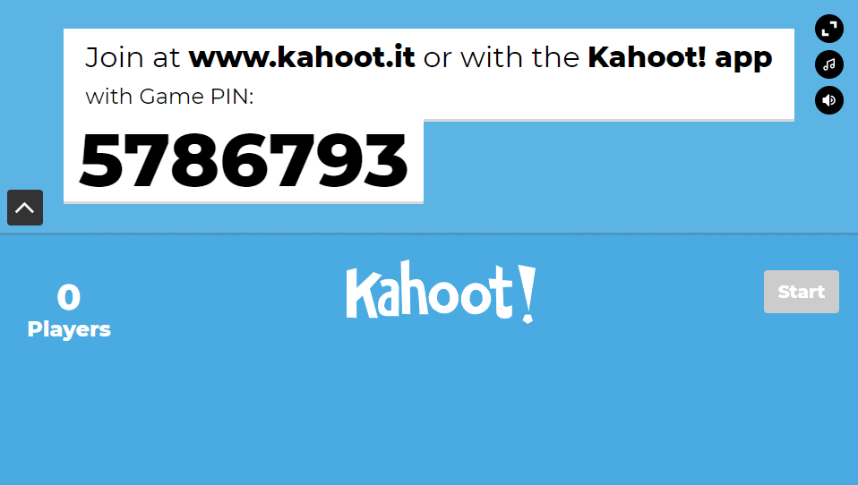

# kahoot-bot

Simple Node script to emulate users in a Kahoot game.

```
Usage: node index [kahoot game id] [username] [bot count]
Example: node index 3601797 george 25
```

After cloning the repo, type `npm install` in the directory to install the required modules.

This currently only supports the "Classic" game mode with multiple choice answers. Open an issue to request support for other game modes.



---

## How does it work?

Kahoot uses [cometd](https://cometd.org/) as an event based messaging service. This script simply emulates the client side actions to join any Kahoot game and randomly answer questions.

Kahoot tries to use some obfuscation to stop bots like this by sending a "challenge" (piece of Javascript code) that is evaluated client side to determine the comet token.

Here is an example of a challenge:
```javascript
decode.call(this, 'KWWegtcjd7X3zvwL98druR5Vj58Om8OBSpDYO2px2MEMF6KW7JqhxeuSXyqqxWeYGiiRsSRTWgn67DcJBTGV08XJEBQjGWYeWJyR');

function decode(message) {
  var offset = (20 + ((61 + 3) + 22 + 86));
  if (this.angular.isObject(offset)) console.log("Offset derived as: {", offset, "}");
    return _.replace(message, /./g, function(char, position) {
      return String.fromCharCode((((char.charCodeAt(0) * position) + offset) % 77) + 48);
    });
}
```

This challenge is evaluated (using Node's `vm` api) with some context given to define functions such as `angular` and `_`, the `decode` function then returns the comet token, in this case `d688f69bf68a203df0d3c93caffd837863fffe4a847364cf535df0e04fe27f86403c198b2d879871f6b437b2a26f994b`.

This comet token is then used to establish a connection with Kahoot and emulate a user.

# What else?

The script can be adapted to support virtually any Kahoot game mode, feature or user interaction. This script is just a proof of concept to demonstrate how to begin emulating a user.